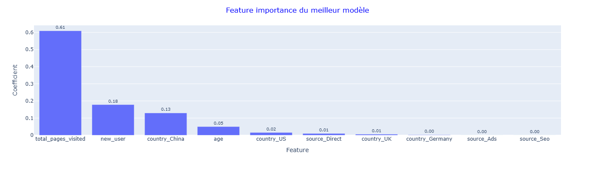

# Machine_Learning_Projects-Certification

## Projet Conversion Rate


## Table des matières

- [A propos du projet](#a-propos-du-projet)
- [Problématique liée au projet](#problematique-liee-au-projet)
- [Objectifs](#objectifs)
- [Résultats du meilleur modèle](#resultats-du-meilleur-modele)
- [Résumé des résultats](#resume-des-resultats)
- [Dataset](#dataset)
- [Architecture du dossier Conversion_Rate_Prediction-Project](#architecture-du-dossier-conversion-rate-prediction-project)
- [Contenu du repository](#contenu-du-repository)
- [Informations diverses](#informations-diverses)
- [Auteur](#auteur)

## A propos du projet  

L’objectif de ce projet est double :  
- Construire un modèle prédictif capable d’estimer la probabilité qu’un utilisateur s’abonne à la newsletter à partir de quelques variables (pays, âge, source, nombre de pages visitées et statut).  
- Analyser les facteurs explicatifs de cette conversion afin d’identifier les variables les plus influentes.  

## Problématique liée au projet  

Quelles variables influences un utilisateur à s'abonner à la newsletter ?  
Quel modèle peut estimer la probabilité qu'un utiliseur s'abonne à la newsletter ?  

## Objectifs

- Créer une EDA et les prétraitements et entraîner un modèle de base avec le fichier data_train.csv  
- Améliorer le score f1 du modèle sur l'ensemble de tests  
- Utiliser le meilleur modèle pour faire quelques prédictions avec le fichier data_test.csv  
- Analyser les paramètres du meilleur modèle  

## Résultats du meilleur modèle



## Résumé des résultats

En résumé, le modèle XGBoost confirme que l’engagement utilisateur est le principal facteur de conversion, suivi du statut de nouvel utilisateur. Les variables géographiques ont un effet secondaire et les canaux d’acquisition sont peu influents.  
Le modèle XGBoost optimisé est retenu comme modèle final pour la prédiction.  

| Modèle                  | F1 binary | F1 macro | F1 weighted |  
|------------------------|----------|----------|-------------|  
| Train                  | 0.768    | 0.880    | 0.985       |  
| Test                   | 0.765    | 0.878    | 0.985       |  

## Dataset

- Dataset d'entraînement : conversion_data_train.csv  
- Dataset de test : conversion_data_test.csv  
 
## Source du dataset 

Ce dataset a été fourni dans le cadre de la formation Jedha Bootcamp.
Il est basé sur un dataset Kaggle et a été modifié par Jedha, mais la lien original des données n’est pas précisé.  

## Architecture du dossier Conversion_Rate_Prediction-Project

```
├── Conversion_Rate_Prediction-Project
├────── data
│       └── conversion_data_test.csv
│       └── conversion_data_test_predictions_GREGORY_xgboost.csv
│       └── conversion_data_train.csv
├────── images
│       └── graphique.png
│   └── Projet_Conversion_Rate.ipynb
│   └── README.md
```
## Contenu du repository  

📁 data :  
  Dataset de test pour faire des prédictions avec le meilleur modèle (conversion_data_test.csv)  
  Fichier contenant les prédictions obtenu avec notre meilleur modèle (conversion_data_test_predictions_GREGORY_xgboost.csv)  
  Dataset original pour l'entraînement du modèle (conversion_data_train.csv)  

📁 images :  
  Graphique utilisé dans le readme  

📄 Projet_Conversion_Rate.ipynb :  
  Notebook du projet  

📄 README.md :  
  Ce fichier décrit le projet et sert de page d'accueil GitHub  

## Informations diverses

Temps d'exécution global du notebook : 3min25s

## Auteur
 
Grégory Augis   
Projets un sur trois réalisé dans le cadre de la certification du bloc 3 Data Analyst — Jedha Bootcamp.