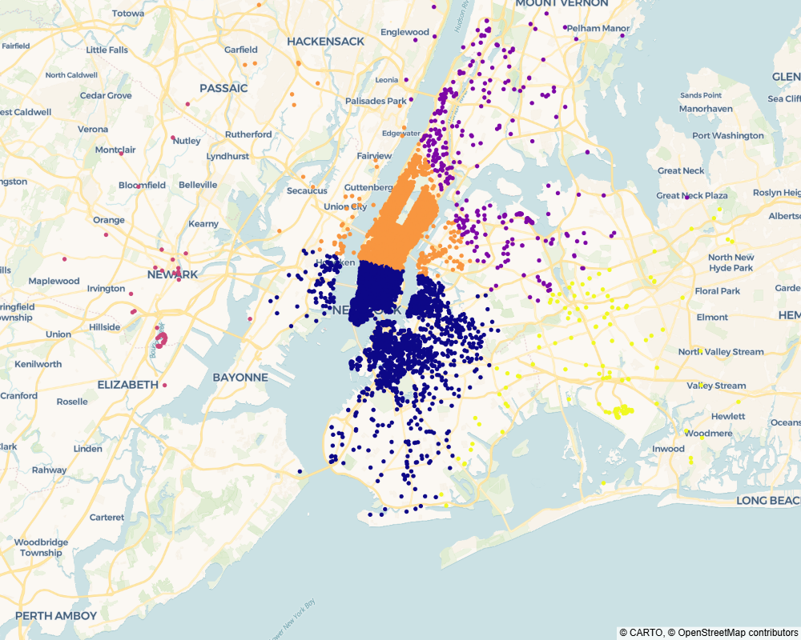

# Machine_Learning_Projects-Certification

#  Projet Uber


## Table des matières

- [A propos du projet](#a-propos-du-projet)
- [Problématique liée au projet](#problematique-liee-au-projet)
- [Objectifs](#objectifs)
- [Carte de densité filtrée pour la période de 12 à 13h le 01-04-2014](#carte-de-densite-filtree-pour-la-periode-de-12-a-13h-le-01-04-2014)
- [Résumé des résultats](#resume-des-resultats)
- [Dataset](#dataset)
- [Architecture du dossier Uber_Pickups-Project](#architecture-du-dossier-uber-pickups-project)
- [Contenu du repository](#contenu-du-repository)
- [Informations diverses](#informations-diverses)
- [Auteur](#auteur)

## A propos du projet  

Uber est une entreprise mondiale de mobilité qui a évolué d’une simple application de covoiturage vers une plateforme multi-services (transport, livraison de repas, colis, etc.), opérant dans des centaines de villes à travers le monde.  

L’un de ses principaux défis est le déséquilibre entre l’offre (chauffeurs) et la demande (utilisateurs) en temps réel. Il arrive que des chauffeurs soient concentrés dans certaines zones tandis que la demande se situe ailleurs, ce qui entraîne des temps d’attente trop longs (10 à 15 minutes), dépassant le seuil acceptable pour les utilisateurs (5 à 7 minutes).  

Le projet vise donc à développer une solution capable d’identifier et recommander des “zones chaudes” dans les villes, afin d’orienter les chauffeurs vers les zones où la demande est la plus forte à chaque moment de la journée, et ainsi réduire le temps d’attente et améliorer l’expérience utilisateur.   

## Problématique liée au projet  

Dans quelles zones les conducteurs doivent se trouver pour ne pas dépasser le seuil d'attente des utilisateurs ?   

## Objectifs

Créer un algorithme qui déterminera où se trouvent les zones chaudes dans lesquelles les conducteurs doivent se trouver.  
Visualisez les résultats sur un tableau de bord.  

## Carte de densité filtrée pour la période de 12 à 13h le 01-04-2014



## Résumé des résultats

L’ensemble des analyses (horaire et journalière), complétées par le clustering et la heatmap, met en évidence une structure de mobilité très stable à New York City, dominée par une forte centralité de Manhattan.  

Cette spatialité se retrouve de manière constante à toutes les échelles temporelles. Les variations observées (heure ou jour) n’affectent pas la structure globale, mais seulement l’intensité des flux. La heatmap confirme également cette concentration persistante autour de Manhattan.  
 
Les résultats suggèrent que Manhattan constitue la principale zone de demande, et donc un secteur stratégique pour positionner une part importante des chauffeurs Uber.  

## Datasets

8 datasets fournis pour l'étude :  

- taxi-zone-lookup.csv  
- uber-raw-data-apr14.csv  
- uber-raw-data-aug14.csv  
- uber-raw-data-janjune-15.csv.zip  
- uber-raw-data-jul14.csv  
- uber-raw-data-jun14.csv  
- uber-raw-data-may14.csv  
- uber-raw-data-sep14.csv  

Seul le dataset contenant les données d'avril 2014 est utilisé dans le projet : uber-raw-data-apr14.csv  
Le dataset taxi-zone-lookup.csv contenant uniquement un nom de quartier et un nom de zone sans coordonnées, il a été ignoré dans l'étude.  
 
## Source du dataset 

Ce dataset a été fourni dans le cadre de la formation Jedha Bootcamp.
Il est basé sur un dataset Kaggle et a été modifié par Jedha, mais la lien original des données n’est pas précisé.  

## Architecture du dossier Uber_Pickups-Project

```
├── Uber_Pickups-Project
├────── data
│       └── uber-raw-data-apr14.csv
├────── images
│       └── graphique.png
│   └── Projet_Uber_Pickups.ipynb
│   └── README.md
```
## Contenu du repository  

📁 data :  
  Dossier contenant le seul dataset utilisé : uber-raw-data-apr14.csv  

📁 images :  
  Graphique utilisé dans le readme  

📄 Projet_Uber_Pickups.ipynb :  
  Notebook du projet  

📄 README.md :  
  Ce fichier décrit le projet et sert de page d'accueil GitHub  

 ## Dashboard du projet Uber  

 Dashboard hébergé sur huggingface displonible à l'adresse :  
 https://huggingface.co/spaces/GregA2026/Projet_Uber  

## Informations diverses

Temps d'exécution global du notebook : 24s

## Auteur
 
Grégory Augis   
Projets deux sur trois réalisé dans le cadre de la certification du bloc 3 Data Analyst — Jedha Bootcamp.
