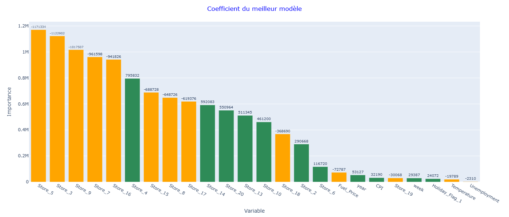

# Machine_Learning_Projects-Certification

# Projet Walmart

.svg.png)

## Table des matières

- [A propos du projet](#a-propos-du-projet)
- [Problématique liée au projet](#problematique-liee-au-projet)
- [Objectifs](#objectifs)
- [Coefficients du meilleur modèle](#coefficients-du-meilleur-modele)
- [Résumé des résultats](#resume-des-resultats)
- [Dataset](#dataset)
- [Architecture du dossier Walmart_Predict_Weekly_Sales-Project](#architecture-du-dossier-walmart-predict-weekly-sales-project)
- [Contenu du repository](#contenu-du-repository)
- [Informations diverses](#informations-diverses)
- [Auteur](#auteur)

## A propos du projet  

Walmart Inc. est une société multinationale américaine de vente au détail qui exploite une chaîne d'hypermarchés, de grands magasins discount et d'épiceries aux États-Unis, dont le siège social est à Bentonville, Arkansas. L'entreprise a été fondée par Sam Walton en 1962.  

Le service marketing de Walmart nous a demandé de construire un modèle d'apprentissage automatique capable d'estimer les ventes hebdomadaires dans leurs magasins, avec la meilleure précision possible sur les prévisions faites. Un tel modèle les aiderait à mieux comprendre comment les ventes sont influencées par les indicateurs économiques et pourrait être utilisé pour planifier de futures campagnes marketing.   

## Problématique liée au projet  

Quels indicateurs économiques influencent les ventes ?   

## Objectifs

- Créer une EDA et tous les prétraitements nécessaires pour préparer les données au machine learning  
- Former un modèle de régression linéaire (de base)   
- Limiter le surapprentissage en entraînant un modèle de régression régularisé   

## Coefficients du meilleur modèle



## Résumé des résultats

L’analyse exploratoire a mis en évidence une forte hétérogénéité entre magasins, une distribution asymétrique des ventes et une saisonnalité marquée, notamment en fin d’année. Les variables économiques, notamment l'indice CPI, apparaissent plus influentes que les variables météorologiques.  

Le modèle Ridge optimisé est retenu comme modèle final en raison de ses meilleures performances en généralisation. Il confirme les tendances principales observées, notamment l’importance dominante des magasins (store) dans l’explication des ventes, tout en apportant une vision plus stable et régularisée de l’impact des différentes variables.  


| Modèle          | R² Train | R² Test | MAE Train | MAE Test | RMSE Train | RMSE Test | MAPE Train (%) | MAPE Test (%) |
|-----------------|----------|---------|-----------|----------|-------------|-----------|----------------|---------------|
| GridSearch Ridge| 0.978    | 0.949   | 76066     | 112515   | 98351       | 156994    | 7.48           | 10.57         |

## Dataset

Dataset utilisé : Walmart_Store_sales.csv  
 
## Source du dataset 

Ce dataset a été fourni dans le cadre de la formation Jedha Bootcamp.  
Il est basé sur les données de ventes des magasins Walmart, mais la source originale des données n’est pas précisée. 

## Architecture du dossier Walmart_Predict_Weekly_Sales-Project

```
├── Walmart_Predict_Weekly_Sales-Project
├────── data
│       └── Walmart_Store_sales.csv
├────── images
│       └── graphique.png
│   └── Projet_Walmart.ipynb
│   └── README.md
```
## Contenu du repository  

📁 data :  
  Dossier contenant le dataset utilisé : Walmart_Store_sales.csv   

📁 images :  
  Graphique utilisé dans le readme  

📄 Projet_Walmart.ipynb :  
  Notebook du projet  

📄 README.md :  
  Ce fichier décrit le projet et sert de page d'accueil GitHub  

## Informations diverses

Temps d'exécution global du notebook : <2s

## Auteur
 
Grégory Augis   
Projets deux sur trois réalisé dans le cadre de la certification du bloc 3 Data Analyst — Jedha Bootcamp.